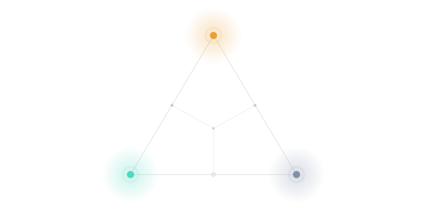
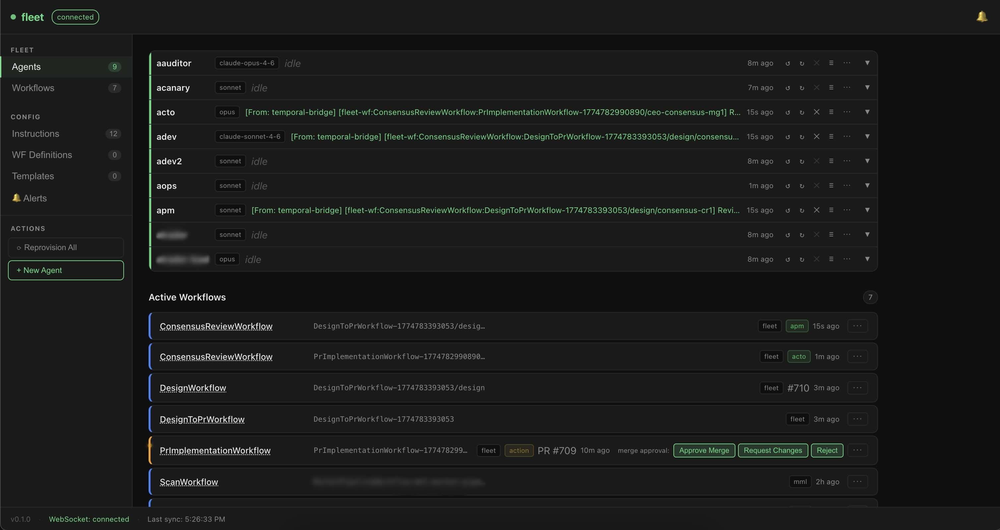
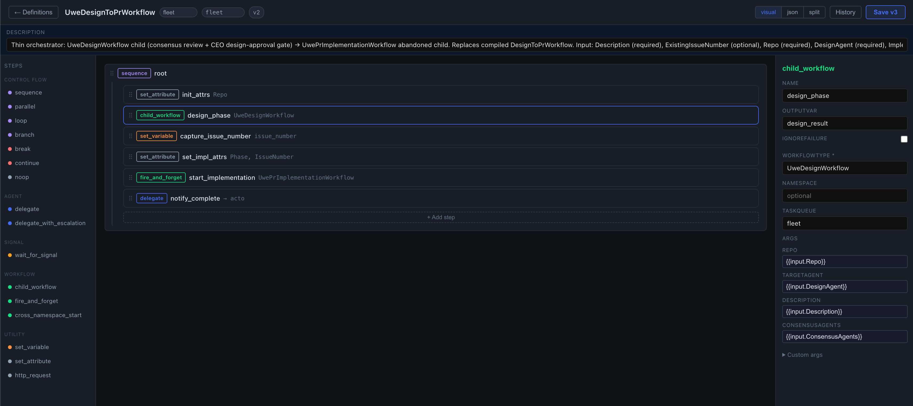

# Phleet — Autonomous Multi-Agent Platform

<p align="center">
  
</p>

Phleet is an open-source, self-hosted multi-agent AI platform built on .NET 10. Each agent runs as a Docker container on your own host, uses your own Claude or Codex credentials, hits your repos via your own GitHub App, and is coordinated by a central orchestrator backed by Temporal workflows. Control plane, state, workflow history, and memory stay on infrastructure you control — only model-inference traffic goes to your chosen provider. No managed tier, no vendor quota, no "we're deprecating this feature in 60 days" risk. You own the fleet end-to-end.

<p align="center">
  
  <br>
  <em>The fleet dashboard — live agent status, model assignment, and in-flight Temporal workflows.</em>
</p>

## Quickstart

```bash
# 1. Clone the repo
git clone https://github.com/anurmatov/phleet.git
cd phleet

# 2. Run the setup wizard
./setup.sh
```

You'll need **Docker + Docker Compose**, **two Telegram bot tokens**, and **a GitHub App** — details below. `setup.sh` will prompt for these as it runs; you can keep the links in this page open while it asks.

`setup.sh` creates a `./fleet/` subdirectory next to the repo and puts all runtime state there: `.env`, `seed.json`, generated `docker-compose.yml`, `workspaces/`, `memories/`, credentials, and mysql backups. The whole dir is gitignored — to fully reset, stop containers and `rm -rf fleet/`.

`seed.example.json` at the repo root ships with **no agents**. Your first agent — the co-CTO — is created interactively via the dashboard's SetupBanner after `setup.sh` finishes. Open the dashboard, connect Telegram, then click the CTO template card and follow the prompts. Once the co-CTO is up, DM it in Telegram and ask it to grow the rest of the fleet for you.

### What you'll need during setup

- Docker and Docker Compose
- **Two Telegram bots** created via [@BotFather](https://t.me/BotFather):
  - a **CTO bot** — dedicated to the co-CTO agent's DMs with you (`TELEGRAM_CTO_BOT_TOKEN`)
  - a **notifier bot** — shared by every other agent for DMs and group-chat relay (`TELEGRAM_NOTIFIER_BOT_TOKEN`)

  You can technically reuse a single token if you only ever run the co-CTO, but the moment a second agent exists you need the split: Telegram allows only one long-poller per token (see the Troubleshooting entry on 409 Conflict).
- **A Telegram group** (optional) for observing agent activity. Create a group, add **both** bots as members, then forward any message from the group to [@userinfobot](https://t.me/userinfobot) — it replies with the group's negative integer ID, which you'll paste into `.env` as `FLEET_GROUP_CHAT_ID` during setup. Agents post workflow notifications and status updates there. Leaving the ID blank disables group routing — agents then only respond to DMs, and all coordination happens through Temporal workflows.
- A GitHub App with repo access ([create one](https://github.com/settings/apps))

### Start/stop the stack later

`setup.sh` starts services for you. To start/stop them later, run compose from the `./fleet/` directory:

```bash
cd fleet
docker compose up -d
docker compose down
```

Services started:
- `rabbitmq` — message broker
- `fleet-mysql` — agent config + task history
- `qdrant` — vector store for Fleet Memory
- `temporal-postgresql` — Temporal persistence
- `temporal-server` + `temporal-ui` — workflow engine
- `fleet-minio` (+ `fleet-minio-init`) — S3-compatible store for inter-agent file sharing
- `fleet-memory` — semantic memory MCP server
- `fleet-playwright` — browser automation MCP server
- `fleet-orchestrator` — agent registry + lifecycle manager
- `fleet-temporal-bridge` — Temporal workflow runner
- `fleet-bridge` — RabbitMQ relay
- `fleet-dashboard` — web UI (default: http://localhost:3700)

All stateful services (mysql, qdrant, temporal postgres, minio, memories) bind-mount their data under `./fleet/` — no named Docker volumes. Back up or wipe the whole installation by archiving or removing that single directory.

### Dashboard

The dashboard provides a real-time view of all agents, their status, logs, config, and Temporal workflows. Auth is controlled by `ORCHESTRATOR_AUTH_TOKEN` in `.env`.

## What you get after setup

After `./setup.sh` you have a **single agent** running: the co-CTO. It is the only agent in the orchestrator granted the full agent-lifecycle and workflow-authoring toolset. You don't spin up more agents by editing JSON and restarting containers — you grow the fleet by talking to the co-CTO in Telegram, in plain English.

Things you can ask the co-CTO to do, today, out of the box:

- **Grow the team.** "Create a new developer agent on sonnet, call it `alice`, give it Read/Edit/Bash and fleet-memory, add her to the reporting group." The co-CTO calls `create_agent` → `manage_agent_*` → `provision_agent` and the container is up within a minute.
- **Shrink the team.** "We don't need the research agent anymore, stop it and clean up the workspace." → `stop_agent` / `deprovision_agent`, container gone, workspace archived on request.
- **Edit role instructions live.** "Update the developer role to always run `dotnet test` before committing." → `create_instruction` with a new version, `manage_agent_instructions` to swap it in, old version kept for rollback. No redeploy.
- **Author and version workflows.** "Draft a workflow that spawns a design review, waits for my approval, then runs implementation." → `create_workflow_definition` produces a versioned JSON definition you can run immediately — or open in the visual editor and tweak.
- **Run and gate workflows.** "Start a PR implementation workflow on issue #123 using agent `alice`." → `temporal_start_workflow`. The co-CTO pings you at the human-review gate; you reply *approved* / *changes_requested* / *rejected*.
- **Remember across sessions.** "Memorize that we use Conventional Commits in this repo." → stored in fleet-memory (Qdrant + embeddings), searchable by every agent from any future session.
- **Coordinate the fleet.** The co-CTO maintains an active task-tracker memory, reviews production-risk changes proposed by worker agents before they run, and facilitates the shared Telegram coordination group.

The rest of this README is the plumbing — configuration, deployment, troubleshooting. The point of the co-CTO is that after setup you mostly don't need to touch any of it.

## Learn by watching

Want to see end-to-end agent engineering in action, not just framework docs? This section collects walkthroughs, blog posts, PR deep-dives, and demo videos of Phleet in real use.

- _Posts and walkthroughs coming soon — watch the repo for updates._

If you write about your Phleet setup, open a PR adding it here.

## Project Status

Phleet has been tested end-to-end on **macOS (Apple silicon, Mac Studio) with Claude** as the primary provider — that's the path I actively run. Other combinations should work but haven't been exercised nearly as hard:

- **Linux host** — expected to work (all containers are linux/amd64 or linux/arm64); untested by me at the time of release.
- **Windows host** — Docker Desktop + WSL2 is the intended path. Unverified.
- **Codex provider** — the code paths exist and ship in `seed.example.json`, but Claude has seen far more wall-clock time than Codex in real workflows.

If you run Phleet on Windows, on a Linux host, or with Codex as the primary provider and hit something broken — PRs and issue reports are very welcome. Small fixes and "it works on my box" confirmations are just as valuable as new features here.

## Architecture

```
src/
├── Fleet.Agent/         — core agent process (Telegram + multi-provider AI executor)
├── Fleet.Orchestrator/  — agent registry, lifecycle management, REST/WebSocket/MCP API
├── Fleet.Temporal/      — Temporal workflow engine + bridge (universal workflow runner)
├── Fleet.Bridge/        — RabbitMQ relay for inter-agent messaging
├── Fleet.Memory/        — semantic memory MCP server (Qdrant + ONNX embeddings)
├── Fleet.Telegram/      — outbound Telegram MCP server (per-agent bot routing, notifier fallback)
├── Fleet.Shared/        — shared utilities
└── fleet-dashboard/     — React SPA for monitoring and managing agents
Dockerfile               — agent image (multi-stage, .NET 10)
Dockerfile.temporal      — temporal bridge image
entrypoint.sh            — container init script
gh-auth.sh               — GitHub App JWT utility
```

### How It Works

1. The orchestrator bootstraps agents from `seed.json` into MySQL on first start.
2. Each agent container starts, authenticates via a GitHub App JWT, and launches a persistent AI process (`claude -p` or Codex SDK bridge).
3. Agents receive tasks via Telegram DM or RabbitMQ and stream responses back.
4. Temporal workflows orchestrate multi-step, multi-agent tasks.
5. Fleet Memory provides shared semantic memory across all agents (search, store, retrieve).

### Visual Workflow Editor

Workflows can be authored as versioned JSON definitions through the dashboard's visual editor — no code, no redeploy. Control-flow primitives (`sequence`, `parallel`, `loop`, `branch`), agent delegation, child-workflow spawning, and signal-waiting compose into Temporal workflows that run on the same engine as compiled ones.

<p align="center">
  
  <br>
  <em>Editing a workflow definition — steps, arguments, and live JSON/visual/split views.</em>
</p>

## Build

```bash
# Build the full solution
dotnet build

# Build Docker images from repo root
docker build -t phleet:agent .
docker build -t phleet:orchestrator -f src/Fleet.Orchestrator/Dockerfile .
docker build -t phleet:memory -f src/Fleet.Memory/Dockerfile .
docker build -t phleet:temporal-bridge -f Dockerfile.temporal .
docker build -t phleet:bridge -f src/Fleet.Bridge/Dockerfile .
docker build -t phleet:dashboard \
  --build-arg VITE_AUTH_TOKEN=your-token \
  -f src/fleet-dashboard/Dockerfile .

# Dashboard dev server
cd src/fleet-dashboard && npm install && npm run dev
```

## Tests

```bash
dotnet test
# With output:
dotnet test --logger "console;verbosity=normal"
```

## Configuration

Agent config is database-driven (MySQL via EF Core). On first run, the orchestrator seeds from `seed.json`.

| File | Purpose |
|------|---------|
| `./fleet/.env` | Secrets and environment overrides (generated by setup.sh, never commit) |
| `./fleet/seed.json` | Initial agent definitions for DB bootstrap (never commit production configs) |
| `./fleet/docker-compose.yml` | Generated from `docker-compose.example.yml` with fleet-dir-relative build contexts |
| `./fleet/workspaces/` | Per-agent git workspaces |
| `./fleet/memories/` | Per-agent memory files |
| `./fleet/.claude-credentials.json`, `./fleet/.codex-credentials.json` | AI provider credentials (chmod 600) |
| `src/Fleet.Orchestrator/appsettings.json` | Orchestrator defaults |
| `src/Fleet.Agent/appsettings.json` | Agent image defaults |

The tracked repo root stays clean — only source, `.env.example`, `seed.example.json`, and `docker-compose.example.yml` live there. All runtime state is under `./fleet/`.

See `.env.example` for all required variables with descriptions.

### Agent config fields

Each agent entry in `seed.json` (or created via the co-CTO's `create_agent` flow) has these key fields:

- `name` — unique identifier
- `role` — maps to `src/Fleet.Orchestrator/roles/{role}/system.md` (seeded into the `instructions` table on first boot)
- `model` — e.g. `claude-opus-4-6`, `claude-sonnet-4-6`, `claude-haiku-4-5`
- `shortName` — displayed in group messages when `prefixMessages` is on
- `tools` — whitelist of tool names the agent may call (built-ins + MCP tool IDs)
- `mcpEndpoints` — MCP servers the agent can reach (`fleet-memory`, `fleet-temporal`, etc.)
- `envRefs` — names of env vars the container is allowed to read (e.g. `TELEGRAM_NOTIFIER_BOT_TOKEN`, `GITHUB_APP_ID`)
- `networks` — docker networks to attach (typically `fleet-net`)
- `telegramUsers` / `telegramGroups` — who may DM the agent / which groups it listens to
- `groupListenMode` — `off` / `mention` / `all`
- `telegramSendOnly` — **must be `true`** on every non-CTO agent that shares a Telegram bot token with others (otherwise Telegram returns 409 Conflict — only one long-poller per token)
- `prefixMessages` — when multiple agents share a bot token, set `true` so outgoing group messages are prefixed with the agent's `shortName` (e.g. `[Developer] ...`)

## Troubleshooting

### Agents start returning "unauthorized" from Claude / Codex

OAuth tokens in `./fleet/.claude-credentials.json` and `./fleet/.codex-credentials.json` expire. When they do, every agent backed by that provider starts failing mid-task with an auth error. There is no in-container refresh path — you refresh on the host, then push the new file in.

1. Re-authenticate on your host with the vanilla CLI (`claude` or `codex`). This is the same CLI login flow you used during initial setup.
2. Copy the refreshed credentials into the fleet dir, overwriting the old file:
   ```bash
   # Claude — file location varies by platform:
   # Linux: ~/.claude/.credentials.json
   # macOS: stored in the login keychain as "Claude Code-credentials"
   #   (setup.sh handles the keychain extraction; for a manual refresh,
   #    the easiest path is to re-run ./setup.sh)
   cp ~/.claude/.credentials.json ./fleet/.claude-credentials.json
   chmod 600 ./fleet/.claude-credentials.json

   # Codex
   cp ~/.codex/auth.json ./fleet/.codex-credentials.json
   chmod 600 ./fleet/.codex-credentials.json
   ```
3. Reprovision every affected agent so each container picks up the new file. From the dashboard: click **Reprovision** on each agent. From the CLI:
   ```bash
   TOKEN=$(grep '^ORCHESTRATOR_AUTH_TOKEN=' ./fleet/.env | cut -d= -f2)
   for name in $(curl -s -H "Authorization: Bearer $TOKEN" http://localhost:3600/api/agents | jq -r '.[].name'); do
     curl -s -X POST -H "Authorization: Bearer $TOKEN" "http://localhost:3600/api/agents/$name/reprovision"
   done
   ```

Re-running `./setup.sh` also works — it re-copies the credentials and leaves the stack running.

### Telegram returns 409 Conflict at startup

Telegram allows only one long-poller per bot token. If two or more agents share a bot token and more than one tries to poll, Telegram rejects them all with 409. Fix: set `telegramSendOnly: true` on every non-CTO agent that shares a token — they'll still send messages through the bot but won't poll for incoming updates. Only the CTO agent (or whichever single agent owns DMs for that token) should poll. After editing `seed.json` or the DB, reprovision the affected agents.

### Temporal workflow types list looks empty right after a restart

`temporal_list_workflow_types` populates lazily on first call after `fleet-temporal-bridge` starts. Immediately after a restart it may return only the hardcoded built-ins and none of the seeded UWE workflow definitions. Wait a few seconds and call it again, or start any workflow once to warm the cache.

## License

MIT — see [LICENSE](LICENSE).

## Contributing

See [CONTRIBUTING.md](CONTRIBUTING.md).
