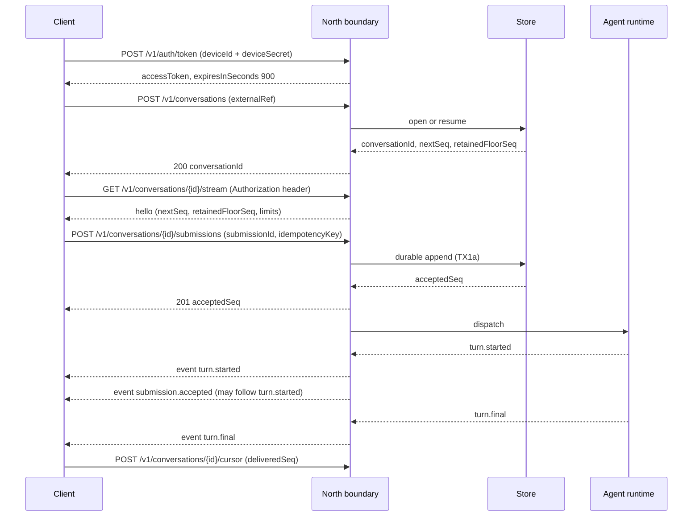
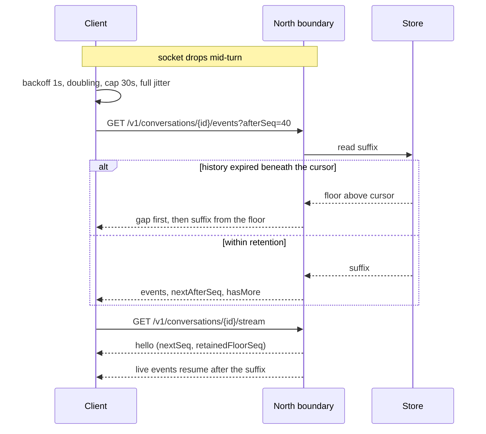

# First-party API — the authenticated north boundary

The HTTPS and WebSocket contract a first-party text client speaks: how it authenticates, opens a
conversation, submits text, receives live events, loses its connection, and resumes without ever
losing a terminal outcome or being told something succeeded when the runtime cannot say so.

**Anchored to `main` at `69ed86f`.** Every claim about merged behaviour below is read at that commit.

This document decides how existing decisions are carried over a network to a client that is not in
the process. It does **not** restate or re-decide the event contract (#274), durability, ordering,
cursors, catch-up or idempotency (#276), or reply ownership and the deployable (#277/#279). Where
writing it surfaced a tension with those, the tension is recorded in
[Proposed amendments](#proposed-amendments-to-274276277) rather than resolved here in this
document's favour. Two documents disagreeing about `seq` is worse than either being wrong alone.

---

## 1. The two boundaries

`Fleet.Comms` serves two surfaces. They are **two surfaces on one process, not one surface with two
kinds of caller**, and conflating them is the single most expensive mistake available here.

| | **South boundary** | **North boundary** |
|---|---|---|
| Between | `Fleet.Agent` → `Fleet.Comms` | first-party client → `Fleet.Comms` |
| Designed by | #276 §4.9, amended by #277 D-4 | **this document** |
| Reachability | private, service-to-service | public, TLS, hostile network |
| Caller | trusted process | untrusted device |
| Credential | service-to-service, out of scope here | device-bound access token (§3) |

### The south endpoint list is NOT served on the north listener

`POST /conversations` · `POST /submissions` · `POST /events:append` · `POST /turns:start` ·
`POST /leases:heartbeat` · `POST /turns:commit` · `POST /cursors` ·
`GET /conversations/{id}/events` · `GET /conversations/{id}/tail`

**None of these is reachable from the north listener.** `/events:append` is why this is stated as a
list rather than a principle: on a device-reachable listener it lets a client write arbitrary events
into the durable log, including forged terminal events. A client that could append its own
`turn.final` could tell itself any answer it liked.

Separation is by **listener**, not by path prefix (D1). The north boundary is a distinct listener
with its own authentication middleware, so a routing mistake cannot silently promote a device to a
trusted service caller, and a path collision between the two surfaces resolves to the north route or
to nothing.

`Fleet.Comms` accepts a caller-supplied `principalId` on **neither** surface (#276 §4.9). On the
north boundary the principal is derived only from the authenticated device record.

### Everything a device can reach

This is the complete list. Anything not here is not reachable with a device credential.

| Method | Route |
|---|---|
| `POST` | `/v1/auth/devices` |
| `POST` | `/v1/auth/token` |
| `POST` | `/v1/auth/devices/{deviceId}:revoke` |
| `GET` | `/v1/session` |
| `POST` | `/v1/conversations` |
| `GET` | `/v1/conversations/{id}/events` |
| `POST` | `/v1/conversations/{id}/submissions` |
| `POST` | `/v1/conversations/{id}:cancel` |
| `POST` | `/v1/conversations/{id}/cursor` |
| `GET` | `/v1/conversations/{id}/stream` (WebSocket upgrade) |

---

## 2. Inherited versus new guarantees

Every guarantee a client depends on, attributed. Nothing here is unattributed, and nothing marked
inherited is re-decided by this document.

| Guarantee | Owner |
|---|---|
| Event envelope, kinds, payload shapes, privacy allowlist | #274 |
| `protocol` is `fleet.conversation.v1`; additive-minor evolution; enum values append-only | #274, #276 §9 |
| Adapter failure never faults a turn | #274 D11 |
| `control.ack` acknowledges the request, not the stop | #274 D8 |
| Attachments rejected outright, never silently dropped | #274 D14 |
| `seq` allocated at durable append, not at publish | #276 D-3 |
| `submission.accepted` does not necessarily precede `turn.started` | #276 §4.1 |
| `turn.progress` and `turn.notice` are prunable | #276 D-11 |
| `conversation.replay_gap` carries `seq: null` and is never stored | #276 D-16 |
| Catch-up semantics, `afterSeq`, `limit` default 200 / max 1000, retained floor | #276 §4.8 |
| Idempotency-key semantics and the GC horizon | #276 §7 |
| Cursor kind `conversation.ack`, `clientInstanceId` bookkeeping | #276 D-18 |
| Lease expiry → `turn.outcome_unknown { attempt_abandoned }` | #276 §4.7 |
| One deployable; `Fleet.Conversations` is the only holder of the database credential | #277 D-4 |
| Admission and the queue are global, not per-conversation | #277 D-5 |
| Cancel dispatched with `userId: 0`, so the Telegram cross-chat fallback cannot fire | #277 D-5 |
| Telegram and relay are runtime-owned; their events are `not_routed` | #274 D15, merged `ChannelIds` |
| **Listener separation between north and south** | **this document, D1** |
| **Device enrollment, credential lifecycle, revocation bound** | **this document, D2** |
| **WebSocket credential placement** | **this document, D3** |
| **Identifier ownership and the single validation rule** | **this document, D4** |
| **HTTPS route set, status mapping, rate-limit carrier** | **this document, D5–D5d** |
| **WebSocket framing, `hello`, receive-mostly rule** | **this document, D6** |
| **Resume case table over the network** | **this document, D7** |
| **Client-observable submission lifecycle and the non-`2xx` rule** | **this document, D8** |
| **Backpressure, liveness, backoff, close codes** | **this document, D9** |
| **Migration and channel-id allocation** | **this document, D12** |

### Five inherited facts a client author will otherwise get wrong

1. **`submission.accepted` does not necessarily precede `turn.started`.** On the `Ran` path
   `turn.started` is emitted first and takes the lower `seq`. A client that waits for `accepted`
   before rendering a running turn **will hang**.
2. **`seq` is allocated at durable append**, not at publish.
3. **`turn.progress` and `turn.notice` are prunable.** A missing `seq` for one of those is **not** a
   gap and is not proof of loss.
4. **`conversation.replay_gap` carries `seq: null` and is never stored.** Catch-up is
   request/response, so its ordering is array order, not `seq` order.
5. **Admission and the queue are global, not per-conversation.** A Telegram burst can exhaust
   `MaxQueueDepth` and a first-party submission then receives `queue_full`.

---

## 3. Authentication and credential lifecycle (D2)

Three stages. Each exists because the stage before it cannot do its job.

### Stage 1 — enrollment

The operator issues a single-use enrollment code out of band.

| Parameter | Value |
|---|---|
| Entropy | **256 bits** from a CSPRNG |
| Absolute TTL | **15 minutes** from issue, never extended or refreshed |
| Uses | one, consumed atomically, subject only to the recovery window in §3.4 |
| Binding | the one owner principal, fixed at issue time |

An expired or already-burned code fails exactly like an unknown one.

### Stage 2 — device registration

`POST /v1/auth/devices` exchanges the enrollment code for a `deviceId` and a `deviceSecret`.

| Parameter | Value |
|---|---|
| `deviceSecret` entropy | **256 bits** from a CSPRNG |
| Returned | exactly once, in the registration response |
| Server-side storage | **Argon2id** hash with a **per-record salt**; the secret itself is never stored |
| Client-side storage | the platform secure store |

**Owner-only means exactly one active device in this slice.** Registering a second device while one
is active fails with `device_limit`. Rotation is an explicit revoke-then-enroll, never an implicit
replacement — an implicit replacement would let anyone holding a stolen enrollment code silently
displace the owner's working device.

### Stage 3 — access tokens

`POST /v1/auth/token` exchanges `deviceId` + `deviceSecret` for a bearer token.

| Parameter | Value |
|---|---|
| Form | **opaque**, not a JWT |
| Entropy | **256 bits** from a CSPRNG |
| TTL | **15 minutes** |
| Expiry | absolute, **stored at issue time**, never recomputed at check time |

**There is no refresh token.** Refresh is a fresh `deviceId` + `deviceSecret` exchange at the same
endpoint, and the client re-presents ahead of expiry. A refresh token would be a second long-lived
credential with its own rotation, revocation and theft story, bought to save one round trip every
fifteen minutes against a credential the client already holds.

**Opaque rather than JWT is a decision, not a preference.** A JWT buys stateless validation that a
single deployable does not need, and costs immediate revocation, key distribution and an
algorithm-confusion surface. An opaque token is a server-side lookup that can be revoked in one
statement.

Storing absolute expiry at issue time is what makes a **backward clock jump** fail closed rather
than extend a token's life (see the dependency table).

### 3.4 Recovery when the registration response is lost

The server commits the device record and the secret hash before it can know the response arrived. A
client that loses the response holds no secret while the server holds an active device that blocks
re-registration — so without a stated path **the owner is locked out by a dropped packet**.

The path is a bounded **re-presentation window**:

- Re-presenting the **same** enrollment code returns the **same** `deviceId` with a **newly rotated**
  `deviceSecret`, invalidating the previous one.
- The window closes at the **earlier** of **15 minutes from first registration**, or **the moment
  that device first successfully mints an access token**.
- Once closed, re-presentation fails as an unknown code. Recovery is then operator revoke-and-
  re-enroll.
- Each rotation is logged as a distinct registration event, so repeated rotation on one code is
  visible rather than silent.

**Is the window bounded by the enrollment code's own 15-minute issue TTL? No — deliberately.** The
window is evaluated independently and may outlive the issue TTL. The issue TTL bounds how long an
*unused* code may sit around; the window bounds how long a *consumed* code may rotate a secret for a
device that has never authenticated. Applying both would give a registration made late in the code's
life a truncated — possibly zero-length — recovery window, which is precisely the moment a client
most needs one. The absolute cap is 15 minutes from first registration regardless of how much issue
TTL remained.

**Closing on first successful token mint — not on the timer alone — is what stops this being a
re-issue oracle.** The instant the device proves it holds the secret, the only party who could
benefit from another copy is an attacker. A timer-only window keeps handing out fresh secrets for a
credential already proven to be in the client's hands.

### 3.5 Revocation is bounded, not best-effort

| Surface | When revocation takes effect |
|---|---|
| HTTPS | on the next request, immediately |
| Open WebSocket | **within 30 seconds** |

The stream layer re-validates the token on a fixed **30-second** interval and closes with `4401`
when it fails, rather than trusting the value captured at upgrade. Thirty seconds is the stated
worst case a revoking operator may rely on. A design that promises only "eventually" gives the
operator nothing to act on.

### 3.6 Failures are indistinguishable

Enrollment-code failure, unknown device, bad secret, expired token and revoked token all return
**`401`** with `ProtocolErrorCode.Unauthorized` and the fixed message from `ProtocolErrors`. They are
**indistinguishable to the caller**.

The distinguishing detail is logged server-side **without the presented value** — the log records
which check failed, never the code, secret or token that failed it, and never a prefix of one.

### 3.7 WebSocket credential placement (D3)

The upgrade request carries `Authorization: Bearer <token>`. A native client can set upgrade headers;
this is not a browser contract and must not be designed for one.

**The token MUST NOT appear in a query string, path segment or fragment.** URLs are logged by
intermediaries, retained in access logs and stored in crash reports — a token in a URL is a token in
a log file. If a future browser client needs an alternative, it gets a single-use, short-TTL ticket
minted over HTTPS and redeemed at upgrade, designed then rather than pre-emptively.

---

## 4. Identifier ownership (D4)

| Identifier | Chosen by | Why |
|---|---|---|
| `conversationId` | **server** | Canonical, opaque, unguessable. A client-chosen id is an enumeration and collision surface |
| `externalRef` | client | Makes `conversation.open` idempotent across reinstall and retry |
| `submissionId` | **client** | It is the retry unit; server assignment makes a timed-out create unresolvable |
| `idempotencyKey` | client, optional | #276 §7 semantics verbatim |
| `clientInstanceId` | client | Opaque bookkeeping label for cursors. **Not a credential, and not device identity** |
| `principalId` | **server** | Derived from the device record. Never accepted from input |
| `eventId` | server | Dedupe key |
| `seq` | server | Per-conversation order, allocated at durable append |

Every client-chosen identifier — `externalRef`, `submissionId`, `idempotencyKey`,
`clientInstanceId` — is validated against **one** rule, not four:

| Property | Value |
|---|---|
| Charset | `[A-Za-z0-9_-]`, exactly. No dots, slashes, colons or whitespace |
| Length | **1–128 characters** inclusive |
| Comparison | ordinal, case-sensitive |

128 matches the `idempotencyKey` bound #276 §7 already fixes, so the four identifiers share one
validator rather than drifting apart.

A value outside the rule is `protocol.rejected { code: "unsupported_kind" }` at the route boundary,
**before any store call**. Identifiers are never parsed for meaning and never used to derive
authorisation.

---

## 5. HTTPS surface (D5)

All routes are under `/v1/`. Every request and response body carries
`protocol: "fleet.conversation.v1"`. Media type `application/json`.

| Method | Route | Purpose |
|---|---|---|
| `POST` | `/v1/auth/devices` | Register a device with an enrollment code |
| `POST` | `/v1/auth/token` | Mint an access token |
| `POST` | `/v1/auth/devices/{deviceId}:revoke` | **Self-revoke only** (§5.5) |
| `GET` | `/v1/session` | Bound principal, agent label, server limits, protocol version |
| `POST` | `/v1/conversations` | Open or resume by `externalRef` |
| `GET` | `/v1/conversations/{id}/events` | Catch-up |
| `POST` | `/v1/conversations/{id}/submissions` | Create **or** steer |
| `POST` | `/v1/conversations/{id}:cancel` | `scope: "current" \| "all"` |
| `POST` | `/v1/conversations/{id}/cursor` | `conversation.ack { deliveredSeq, readSeq? }` |
| `GET` | `/v1/conversations/{id}/stream` | WebSocket upgrade |

**One submissions route, two types.** Create and steer both produce a submission and both run the
ordinary inject-or-queue dispatch (#274 D5). Two routes would imply two code paths and invite a
client to believe steer modifies an existing submission. It does not.

### 5.1 Worked requests and responses

**Register a device.**

```http
POST /v1/auth/devices
Content-Type: application/json

{ "protocol": "fleet.conversation.v1", "enrollmentCode": "<256-bit value, base64url>" }
```

```json
{
  "protocol": "fleet.conversation.v1",
  "deviceId": "dev_7xKq2mNp",
  "deviceSecret": "<256-bit value, base64url — returned exactly once>"
}
```

**Mint an access token.**

```http
POST /v1/auth/token
Content-Type: application/json

{ "protocol": "fleet.conversation.v1", "deviceId": "dev_7xKq2mNp", "deviceSecret": "<secret>" }
```

```json
{ "protocol": "fleet.conversation.v1", "accessToken": "<opaque>", "expiresInSeconds": 900 }
```

**Session.**

```http
GET /v1/session
Authorization: Bearer <token>
```

```json
{
  "protocol": "fleet.conversation.v1",
  "principalId": "p_owner",
  "agentLabel": "assistant",
  "limits": {
    "inboundTextBytes": 32768,
    "catchUpLimitDefault": 200,
    "catchUpLimitMax": 1000,
    "identifierMaxLength": 128,
    "outboundBufferEvents": 256
  }
}
```

**Open or resume a conversation.**

```http
POST /v1/conversations
Authorization: Bearer <token>

{ "protocol": "fleet.conversation.v1", "externalRef": "main-thread" }
```

```json
{
  "protocol": "fleet.conversation.v1",
  "conversationId": "c_4Jd8Ls2w",
  "nextSeq": 41,
  "retainedFloorSeq": 12
}
```

**Catch up.** `afterSeq`, `limit` — **default 200, maximum 1000** (#276 §4.8). A `limit` above the
maximum is `unsupported_kind`, **not silently clamped**: a client that asked for 5000 and received
1000 without being told would conclude it had the whole suffix.

```http
GET /v1/conversations/c_4Jd8Ls2w/events?afterSeq=11&limit=200
Authorization: Bearer <token>
```

```json
{
  "protocol": "fleet.conversation.v1",
  "gap": { "fromSeq": 12, "toSeq": 19, "retainedFloorSeq": 20 },
  "events": [ { "protocol": "fleet.conversation.v1", "eventId": "…", "seq": 20, "kind": "turn.started", "…": "…" } ],
  "nextAfterSeq": 40,
  "hasMore": false
}
```

`gap` is present only when history has expired beneath the cursor, and it comes **first**. It is the
`conversation.replay_gap` payload, which carries `seq: null` and is never stored (#276 D-16) — so in
this response it is a field, not an element of `events`.

**Submit.**

```http
POST /v1/conversations/c_4Jd8Ls2w/submissions
Authorization: Bearer <token>

{
  "protocol": "fleet.conversation.v1",
  "type": "create",
  "submissionId": "s_9Qw1Ez",
  "idempotencyKey": "s_9Qw1Ez-1",
  "text": "…"
}
```

```json
{ "protocol": "fleet.conversation.v1", "submissionId": "s_9Qw1Ez", "acceptedSeq": 41 }
```

**Cancel.**

```http
POST /v1/conversations/c_4Jd8Ls2w:cancel
Authorization: Bearer <token>

{ "protocol": "fleet.conversation.v1", "scope": "current" }
```

**Advance the cursor.**

```http
POST /v1/conversations/c_4Jd8Ls2w/cursor
Authorization: Bearer <token>

{
  "protocol": "fleet.conversation.v1",
  "clientInstanceId": "inst_a1",
  "deliveredSeq": 41,
  "readSeq": 41
}
```

### 5.2 Error codes and HTTP status (D5a)

Two classes, and conflating them is a real mistake: some codes are HTTP responses, others only ever
appear inside a terminal event payload and have no status at all.

| Code | HTTP status | Where it appears |
|---|---|---|
| `unauthorized` | **401** | every authenticated route; also WebSocket close `4401` |
| `unsupported_role` | **403** | `conversation.open` |
| `unsupported_protocol` | **400** | any route |
| `unsupported_kind` | **400** | malformed body, bad identifier, `limit` above max |
| `unsupported_attachments` | **400** | submissions with a non-empty attachment array |
| `invalid_cursor` † | **400** | catch-up, cursor write |
| `conversation_not_found` | **404** | every conversation-scoped route |
| `idempotency_conflict` † | **409** | submissions |
| `device_limit` ‡ | **409** | device registration |
| `payload_too_large` | **413** | submissions above the inbound text bound (32 KiB) |
| `rate_limited` | **429**, with `Retry-After` | any route; see §5.4 |
| `internal` | **500** *or* **503** — see below | any route |
| `runtime_busy` | **503** | any route, while the runtime cannot admit work |
| `executor_error` | *(none)* | **event-only** — `turn.error` payload |
| `canceled` | *(none)* | **event-only** — terminal payloads |

† Added to `ProtocolErrorCode` by the #276 implementation (§9). ‡ Proposed by this document; see
[Proposed amendments](#proposed-amendments-to-274276277).

That table covers every member of `ProtocolErrorCode` as it exists at `69ed86f`, plus the three
inbound members, and marks the two event-only codes as having no status.

**`internal` carries two statuses, and the split is not cosmetic.**

| Condition | Status | Client action |
|---|---|---|
| A fault inside the boundary — unhandled path, contract violation, bug | **500** | Do not hammer. Retry once with backoff; escalate if persistent |
| A required dependency is unavailable — store, token store, enrollment store | **503** | Retry with backoff; the same `idempotencyKey` is safe and expected |

Both carry the **identical fixed body**, so the distinction is the status line and nothing else — a
client must not parse the body to tell them apart. `500` means the request was understood and the
server is broken; `503` means the server is fine and something it needs is not. That is the
difference between "report this" and "try again shortly".

A `401` body is the fixed constant from `ProtocolErrors`. No status's body ever carries runtime or
exception text.

### 5.3 `queue_full` and `dropped` are dispositions, not errors (D5d)

| | `queue_full` | `runtime_busy` |
|---|---|---|
| Type | `SubmissionDisposition` | `ProtocolErrorCode` |
| Where it appears | `submission.accepted { disposition: "queue_full" }` | an HTTP error body |
| HTTP status | **none** — the submission already returned `201` | `503` |
| Durability | **durably accepted**; `queue_full` is its terminal outcome, carrying `terminal_seq = accepted_seq` | nothing was written |

**`queue_full` must not be aliased to `runtime_busy`.** Doing so would report a `503` for a
submission that is durably committed to the log — a false failure, and the exact thing §7's rule
forbids. A client that retried on that `503` would create a **second submission** for work the server
had already terminally resolved.

`dropped` is the other disposition that is terminal on arrival, and the same applies. Both are
delivered as **events on a request that succeeded**.

### 5.4 The rate-limit delay has one carrier, on both transports (D5c)

| Transport | Carrier |
|---|---|
| HTTP `429` | **`Retry-After`**, in **seconds**, as a **non-negative integer** |
| WebSocket `4429` | **the same integer, in decimal, as the close reason string**, and nothing else in that string |

The HTTP-date form of `Retry-After` is **not** used: two accepted formats means two parsers and a
clock-skew argument, for a value that is always a short relative delay here.

A client parses one integer in one format from either transport. **A missing or unparseable value is
treated as 30 seconds** — the backoff cap from §9 — rather than as zero. Defaulting to zero turns a
rate-limit signal into a retry storm.

### 5.5 Revocation, including the device nobody holds any more (D5b)

| Situation | Who acts | How |
|---|---|---|
| Sign-out, uninstall, planned rotation | the device itself | `POST /v1/auth/devices/{deviceId}:revoke`, authenticated as that device |
| **Device lost, stolen, or bricked** | **the operator, out of band** | the deployment's own administrative path, which is **not** part of this boundary |

**There is deliberately no north route that revokes a device without authenticating as it.** The
owner has exactly one active device, so an unauthenticated revoke route would be a **one-request
denial of service against the only way in** — and the caller who most needs it is, by construction,
the one who cannot authenticate.

Operator revocation invalidates the device record and every token it holds, reaches open sockets
within the same **30-second** bound as token revocation, and is followed by a fresh enrollment code.
The administrative mechanism itself is deployment detail and is not specified here. What is
specified: that it exists, that it is the only lost-device path, and that it is **not reachable from
the north listener**.

---

## 6. WebSocket framing (D6)

**The socket is receive-mostly. Client→server frames are exactly `pong`. Nothing else.**

Submissions, steers, cancels **and cursor advances** are HTTPS only.

| Direction | Frames |
|---|---|
| server → client | one `hello`, then `event` frames, plus `ping` |
| client → server | `pong` |

`hello` carries `nextSeq`, `retainedFloorSeq`, the negotiated protocol string and the server's
limits, so a client can decide immediately whether it needs catch-up before trusting the live stream.

```json
{
  "type": "hello",
  "protocol": "fleet.conversation.v1",
  "conversationId": "c_4Jd8Ls2w",
  "nextSeq": 41,
  "retainedFloorSeq": 12,
  "limits": { "outboundBufferEvents": 256, "pingIntervalSeconds": 20, "pongTimeoutSeconds": 10 }
}
```

An `event` frame carries the `ConversationEvent` envelope **verbatim**. No frame type re-encodes an
event differently from its HTTPS catch-up form: **an event delivered by stream and the same event
delivered by catch-up are byte-identical**, so a client has one parser and dedupe works across
transports.

### 6.1 Cursor advance is HTTPS, and the socket `ack` frame is deliberately removed

An earlier revision of this design had both a cursor route and a socket `ack` frame, which
contradicted this section's own rule in the same document. It is resolved by **deleting the frame**
rather than blessing a dual path, for three reasons:

1. The rule survives with **no exception to remember**.
2. A client that has just caught up over HTTPS with the socket down still needs the route — so the
   route is the one that cannot be removed.
3. Cursor advance is monotonic (`GREATEST`), idempotent and not latency-sensitive, so a client
   coalesces and sends it periodically or on background rather than per event.

The protocol kind is still `conversation.ack` (#276 D-18). That kind is transport-agnostic, and
carrying it over HTTPS changes nothing about its semantics.

**This is also the answer to "ordering and deduplication across HTTPS and WebSocket": there is
nothing to reconcile, because a mutation has exactly one path.** Allowing a submission over the
socket would require idempotency, retry and durability semantics to be specified twice and kept in
agreement forever — and a socket that drops mid-send leaves a submission in a state the client
cannot query without the HTTPS route it was trying to avoid.

---

## 7. Resume — the complete case table (D7)

The cursor is `afterSeq`, an **unsigned 64-bit integer**, meaning "I have durably processed every
event up to and including this `seq`". It is **not opaque**; `seq` is already part of the protocol.

| # | Case | Behaviour |
|---|---|---|
| 1 | First connect, no cursor | `hello`, then live events. Client fetches history via catch-up if it wants it |
| 2 | Clean resume, `afterSeq` within retention | Catch-up returns the suffix; stream resumes after it |
| 3 | Duplicate resume (same `afterSeq` twice) | Identical response. Catch-up is a pure read and must be safely repeatable |
| 4 | Expired history, `afterSeq + 1 < retainedFloorSeq` | `gap { fromSeq, toSeq, retainedFloorSeq }` **first**, then the suffix from the floor |
| 5 | `afterSeq >= nextSeq` | `invalid_cursor`. **Never clamped** |
| 6 | Negative, non-integral, or `> 2^63 − 1` | `invalid_cursor`, validated **before** any comparison against the unsigned column |
| 7 | Conversation belongs to another principal | `conversation_not_found`, deliberately indistinguishable from "does not exist" |
| 8 | Gap detected live (`seq` jump on the stream) | Client issues catch-up from its last durable `seq`. A jump is **not** proof of loss |

**Case 5 is never clamped, and that is the point.** A cursor ahead of the server means client
corruption or a restored backup. Clamping it would convert a detectable fault into silent partial
history — the client would carry on believing it had everything.

**Case 7 is an existence-oracle rule.** "Exists but belongs to another principal" and "does not
exist" must be indistinguishable, or the boundary answers questions about conversations the caller
cannot see.

**Case 8 is why prunability matters.** `turn.progress` and `turn.notice` are prunable by contract
(#276 D-11), so a `seq` jump is expected traffic, not evidence of loss.

Cursors are monotonic and never move backwards. `readSeq > deliveredSeq`, or either `>= nextSeq`, is
`invalid_cursor` and **writes nothing**.

---

## 8. Submission lifecycle as the client observes it (D8)

| State | How the client knows | Retryable? |
|---|---|---|
| **Accepted (durable)** | `201` from the submissions route. TX1a has committed | No — retry with the same `idempotencyKey` replays |
| **Accept pending** | `202` with the submission ref; TX1b has not landed | Yes, same key; never starts a second turn (`ReplayPending`) |
| **Dispatched** | `submission.accepted { disposition }` event | — |
| **Started** | `turn.started` — **may arrive before `submission.accepted`** | — |
| **Terminal** | `turn.final` / `turn.error` / `turn.canceled` / `turn.outcome_unknown` | — |
| **Unknown** | `turn.outcome_unknown { reason }`, including `attempt_abandoned` | Client decides; the server never auto-reruns |
| **Unavailable** | Request failed before a durable accept | Yes, same key |

### The rule that makes the whole contract honest

**A non-`2xx` response never means "did not happen". It means "not known to have happened".**

Resolution is always the same: repeat with the same `idempotencyKey`, or catch up and look. **No
response code on this boundary may be documented as proving non-occurrence.**

The honest upper bound on idempotency is the GC horizon (#276 §7): once a key's row is collected the
key is treated as unseen. Client-facing copy must say so rather than implying an unbounded guarantee.

---

## 9. Backpressure, slow clients, and restart (D9)

| Parameter | Value |
|---|---|
| Per-connection outbound buffer | **256 undelivered events** |
| Server `ping` interval | **20 seconds** |
| `pong` timeout | **10 seconds** |
| Reconnect backoff, initial | **1 second** |
| Reconnect backoff, cap | **30 seconds** |
| Backoff reset threshold | connection up for **60 seconds** |

- **Bounded buffer, then close — never drop.** The buffer bound matches the existing in-process
  progress channel capacity (`ConversationEventBus.ProgressChannelCapacity`, 256) so the two do not
  drift. On overflow the server **closes with `4413`**; the client reconnects and catches up from its
  cursor. It does **not** drop events. The durable log makes close-and-resume strictly better than
  silent loss, and **silent loss is the failure a client cannot detect** — on a transport where
  `turn.progress` is legitimately prunable, a dropped event is indistinguishable from an absent one.
- **`4413` is distinct from `4500` on purpose.** A client that sees `4413` knows it is too slow to
  keep up, rather than that the server faulted. That is the difference between widening its read loop
  and retrying blindly.
- **Liveness.** `ping` every 20 seconds; a `pong` not received within 10 seconds closes with `4408`.
  A dead connection is therefore detected **within 30 seconds** — the same bound as revocation, so an
  operator reasoning about "how long until this device is really cut off" has one number, not two.
- **Reconnect backoff.** 1 second initial, doubling, capped at 30 seconds, with **full jitter** over
  the interval. A client never stops retrying; it retries at the cap. Backoff resets to the initial
  value **only after a connection has stayed up for 60 seconds**, so a connection that fails
  immediately after `hello` cannot reset it into a hot loop.
- **Process restart.** In-flight sockets close; clients reconnect and catch up. Nothing durable is
  lost, because `seq` is allocated at durable append.
- **Store outage.** `503` with `Internal` and **no partial success**. It must not fabricate an accept.
- **Adapter/stream failure never faults a turn** (#274 D11). A client being unreachable is not a
  runtime error.
- **Concurrent connections.** One active stream per conversation per `clientInstanceId`. A second
  upgrade closes the older one with `4409`, so two instances cannot silently interleave cursors.

### Close codes

Private range, additive, and **append-only once published**: a code's meaning may never be
redefined, because a deployed client keys its reconnect behaviour on the number.

| Code | Meaning | Client action |
|---|---|---|
| `4401` | Unauthenticated or token revoked | Re-auth, then reconnect |
| `4403` | Not the bound principal | Stop; do not retry |
| `4408` | Liveness timeout | Reconnect with backoff |
| `4409` | Superseded by a newer connection | Do not reconnect this instance |
| `4413` | Outbound buffer overflow — client too slow | Reconnect **and catch up from the cursor** |
| `4429` | Rate limited | Reconnect after the delay in the close reason (§5.4: decimal integer seconds) |
| `4500` | Server fault | Reconnect with backoff |
| `4503` | Draining / restarting | Reconnect with backoff |

---

## 10. Cancel and steer races (D10)

- **Cancel is scoped** — `current` or `all` — and dispatched with `userId: 0`, so the Telegram
  cross-chat fallback can never fire and never writes into a Telegram chat (#277 D-5).
- **`control.ack { accepted, hadRunningTask }` acknowledges the request, not the stop.** The
  authoritative outcome is the subsequent `turn.canceled`. When `hadRunningTask` is `false`, **none
  follows** and the ack is the whole story (#274 D8).
- **Steer after final-answer commitment is refused and queued**, silently by design. A queued message
  is the expected case, not a symptom.
- **Cancel racing a terminal.** The first terminal wins and is the only one. A cancel arriving after
  it yields `control.ack { hadRunningTask: false }`, and the client **must not synthesise a second
  terminal**.

### A first-party turn can end for reasons the client did not initiate

| Telegram command | Can it end a first-party turn? | What the client sees |
|---|---|---|
| `/cancel` | **No** — two independent guards | nothing |
| `/halt` | **Yes** | `turn.canceled { reason: "unknown" }` |
| `/reset` typed in an idle Telegram chat | **Yes** — it can stop the shared provider process out from under a running first-party turn | a terminal the client did not ask for |

A client must be resilient to a turn ending for no reason it initiated. **This is a property of a
shared session, not a bug to paper over.**

---

## 11. Shared session — stated where a client author will read it

**One agent is one provider process and one model context.**

- Conversation separation on this boundary is **routing, not isolation**. This document does not
  claim model-context isolation between conversations, because there is none.
- **Admission and `MaxQueueDepth` are global, not per-conversation** (#277 D-5). A Telegram burst can
  exhaust the queue and a first-party submission then receives `queue_full`.
- A cross-channel busy agent yields `submission.accepted { disposition: "queued" }`, and **the client
  renders "waiting", never "typing"**. Rendering "typing" would assert that the agent is working on
  *this* submission, when it is working on something else entirely.
- This slice is **owner-only**. It is not multi-human tenancy and must not be presented as such.

---

## 12. Threat and abuse model

| Threat | Mitigation |
|---|---|
| Stolen enrollment code | 256-bit entropy; 15-minute absolute TTL; single use; bound to the one owner principal at issue |
| Replayed enrollment code after registration | Re-presentation window closes on first successful token mint, so a proven-held secret is never re-issued |
| Stolen `deviceSecret` | Server stores only an Argon2id hash with a per-record salt; operator revocation invalidates the record and every token within 30 seconds |
| Stolen access token | 15-minute TTL with absolute expiry stored at issue; revocation effective immediately on HTTPS and within 30 seconds on an open socket |
| Token captured from logs or crash reports | Tokens never appear in a URL — header only (§3.7); logs record presence, never value or prefix |
| Credential-stuffing / brute force against auth routes | `rate_limited` (429) with `Retry-After`; all auth failures indistinguishable, so no oracle to grind against |
| Enumeration of conversations | `conversationId` is server-chosen, opaque and unguessable; another principal's conversation returns `conversation_not_found` |
| Forged events in the durable log | The south `/events:append` endpoint is not served on the north listener (§1) |
| Privilege escalation via caller-supplied identity | `principalId` is never accepted from input on either surface |
| Denial of service against the owner's only device | No unauthenticated revoke route exists (§5.5) |
| Client outrunning the server's buffer | Bounded buffer then `4413`; never a silent drop |
| Auth-store outage treated as a pass | **Fail closed**: an auth lookup that cannot complete is `503`, never success |
| Slow-loris / dead connections holding resources | `ping`/`pong` liveness, 30-second detection, `4408` |

---

## 13. Redaction, retention and observability (D11)

- **No submission text, event text, tool name, principal id, device id, token or enrollment code
  appears in any log line or metric label.**
- Metrics are counters and histograms keyed by **route, status, close code and error code only**.
- Logs record the **presence** of a credential, never its value, and **never a prefix of it**.
- `401` bodies are a fixed constant. Error text never comes from an exception.
- Retention of events is the store's, per #276. **The north boundary adds no second copy and no
  cache that outlives the response.**
- The honest upper bound on idempotency is the GC horizon (#276 §7). Client-facing copy must say so.

---

## 14. Migration and compatibility (D12)

- The client channel gets its **own `channelId`**, which is neither `telegram` nor `relay`, and is
  rejected at registration if it collides (#274 D15).
- **Telegram behaviour does not change in any observable way.** Telegram and relay conversations are
  runtime-owned; their events are counted `not_routed` and are **never deliverable over this
  boundary**.
- Phase-0's `ClientChannel:OwnerPrincipalToken` and `ClientChannel:OwnerUserId` remain **operator
  configuration for the in-process seam**. They are **not** the device credential and **must not be
  reachable from the north boundary**. `PrincipalBinder`'s own documentation says it in terms: *"This
  is a binding, not authentication. A shared operator-set token is not an auth scheme."* Handing it
  to a device would turn a deterministic owner check into a shared password.
- The migration is **additive**: the loopback adapter continues to exist for tests.
- All protocol additions are **additive-minor** (#276 §9). `protocol` stays `fleet.conversation.v1`.

---

## 15. Sequence diagrams

### 15.1 Connect, submit, stream



### 15.2 Disconnect and resume



### 15.3 Cancel

```mermaid
sequenceDiagram
    participant C as Client
    participant N as North boundary
    participant A as Agent runtime

    C->>N: POST /v1/conversations/{id}:cancel (scope current)
    N->>A: cancel, userId 0
    N-->>C: event control.ack (accepted, hadRunningTask)
    alt hadRunningTask true
        A-->>N: turn.canceled
        N-->>C: event turn.canceled
    else hadRunningTask false
        Note over C,N: no terminal follows; the ack is the whole story
    end
    Note over C,A: a cancel arriving after a terminal yields hadRunningTask false
```

### 15.4 Restart recovery

```mermaid
sequenceDiagram
    participant C as Client
    participant N as North boundary
    participant S as Store

    Note over N: process restart; in-flight sockets close with 4503
    C->>C: reconnect with backoff
    C->>N: GET /v1/conversations/{id}/events?afterSeq=<last durable seq>
    N->>S: read suffix
    S-->>N: events appended before and during the restart
    N-->>C: suffix
    Note over C,S: nothing durable is lost, because seq is allocated at durable append
    C->>N: GET /v1/conversations/{id}/stream
    N-->>C: hello, then live events
```

---

## 16. External dependency failure paths

| Dependency | Used for | Failure path |
|---|---|---|
| TLS terminator | every north request | Unavailable ⇒ the boundary is unreachable. **No plaintext fallback and no `http://` listener.** Documented, not mitigated |
| Conversation store (via the `Fleet.Conversations` module) | open, accept, catch-up, cursor | Unavailable ⇒ **`503` + `Internal`**, no partial success and **no fabricated accept**. Client retries with the same `idempotencyKey` |
| `Fleet.Agent` runtime | dispatch, turns | Unreachable after a durable accept ⇒ the submission stays accepted; the lease expires and the reconciler emits `turn.outcome_unknown { attempt_abandoned }` (#276 §4.7). **The client is never told the turn succeeded** |
| WebSocket connection | live events | Any close ⇒ reconnect and catch up from the cursor. No event is lost, because **delivery is not the durability boundary** |
| Token store | every authenticated request | Unavailable ⇒ **`503`. Fail closed** — an auth lookup that cannot complete is never treated as success |
| Enrollment code store | registration only | Unavailable ⇒ **`503`**. A code is consumed **atomically or not at all**; a partial consume leaving a code both spent and unusable is a defect this document forbids |
| System clock | token expiry, leases, TTLs | Backward jump ⇒ mitigated by **absolute expiry stored at issue time** rather than computed at check time. Forward jump ⇒ early expiry, which **fails closed** and is acceptable |
| Client device secure store | device secret | Lost (reinstall, restore to a new device) ⇒ the device cannot authenticate. Recovery is **revoke-and-re-enroll, never a silent re-issue** |

---

## 17. Proposed amendments to #274/#276/#277

Recorded here rather than resolved in this document's favour.

### A1 — `ProtocolErrorCode.DeviceLimit`

**Home: `src/Fleet.Protocol/Enums.cs`**, alongside the `IdempotencyConflict` and `InvalidCursor`
members #276 §9 already adds. It lands with the **#276 implementation**, not with this document.

Recording it here rather than quietly using it keeps the enum's append-only rule owned by one issue.
This document ships no `src/` change.

### A2 — Three inherited facts belong in the protocol document

`docs/conversation-protocol.md` does not yet state three facts that a client author reading only it
would get wrong, and all three are already owned by #276 §9:

1. `seq` is allocated at **durable append**, not at publish.
2. `submission.accepted` does **not** necessarily precede `turn.started`.
3. `turn.progress` and `turn.notice` are **prunable**, so their absence is not a gap.

This PR adds them to that document as documentation, under #276's ownership.

### A3 — No tension found requiring a substantive amendment

Writing this document surfaced no case where the network boundary requires a change to durability,
cursors or idempotency semantics. If a future revision appears to, it is filed against #276.

---

## 18. Implementation slices

Each is independently testable, and each acceptance test can be written **before** the code exists.

### Slice 1 — Auth and session

Enrollment, registration, token issue/refresh/revoke, `GET /v1/session`.

- A single enrollment code registers exactly one device; a second attempt with the same code outside
  the recovery window fails as an unknown code.
- Registering a second device while one is active returns `409 device_limit`.
- Re-presenting the same code inside the window returns the same `deviceId` with a rotated secret,
  and the previous secret no longer authenticates.
- The window closes on first successful token mint: a re-presentation after that mint fails.
- Revocation closes an open WebSocket with `4401` within 30 seconds.
- Enrollment failure, unknown device, bad secret, expired token and revoked token produce
  byte-identical `401` responses.
- Every one of those rejections spends the **same** Argon2id evaluation, including the ones where no
  record was found — byte-identical bodies with different elapsed times are still an existence
  oracle for a `deviceId`, an enrollment id or a token id.
- An expired token, an expired unused code and a closed recovery window stay refused across a
  **backward wall-clock step**, and across a restart. Storing an absolute deadline is necessary and
  not sufficient: the deadline is fixed but the value it is compared against is not, so comparison
  runs against a monotonic reading and the record is burned in the store the first time it is seen
  past its deadline.
- A burst of credential attempts is refused with `429 rate_limited` and an integer `Retry-After`
  **before** the request reaches the hasher or takes a store transaction.
- A request with a non-JSON content type, or no body, is `400 unsupported_kind` — a client error,
  not a `500`.
- With the token store unavailable, an authenticated request returns `503` and never succeeds.

#### The store this slice ships

The deployable's default store is **file-backed and durable**, with real transactions; device
registrations, enrollment consumption and revocation survive a restart, and the acceptance points
above are asserted against that engine rather than against a substitute.

There is also an **in-process store, which is a test fixture and is restart-unsafe**: it loses every
device registration when the process exits, so the owner would have to re-enroll with a fresh code
after each restart. It must never be what a deployment runs. A blank store path is refused at
startup rather than silently falling back to it.

A deployment wanting these records in a networked engine implements `IAuthStore` against it —
tracked as [phleet#294](https://github.com/anurmatov/phleet/issues/294), with the same restart,
concurrency, rollback and revocation acceptance points as the shipped implementation.

### Slice 2 — Conversation open and catch-up

`POST /v1/conversations`, `GET /v1/conversations/{id}/events`.

- All eight resume cases from §7, each as its own test.
- A cursor ahead of the server returns `invalid_cursor` and is not clamped.
- A conversation belonging to another principal returns `conversation_not_found`, byte-identical to
  a conversation that does not exist.
- The same catch-up request issued twice returns identical bodies.
- `limit` above 1000 returns `unsupported_kind` rather than a clamped page.

### Slice 3 — Submissions and commands

Create, steer, cancel, cursor.

- Replay with the same `idempotencyKey` returns the original result and starts no second turn.
- A `202` accept-pending resolves to the same submission when retried with the same key.
- `control.ack { hadRunningTask: false }` is followed by no terminal.
- Steer after final-answer commitment is queued, and the client sees a queued disposition rather
  than an error.
- A cursor write with `readSeq > deliveredSeq` returns `invalid_cursor` and writes nothing.

### Slice 4 — Stream

Upgrade, `hello`, event frames, ping/pong, close codes.

- An event delivered over the stream is **byte-identical** to the same event from catch-up.
- Exceeding the 256-event outbound buffer closes with `4413` and drops nothing.
- A second upgrade for the same conversation and `clientInstanceId` closes the older with `4409`.
- A missing `pong` within 10 seconds closes with `4408`.
- No client→server frame other than `pong` is accepted.

### Slice 5 — Observability and redaction

- Under a deliberately adversarial payload — text containing token-shaped and path-shaped values —
  no log line or metric label contains submission text, event text, tool name, principal id, device
  id, token or enrollment code.
- A failed auth attempt logs which check failed and never the presented value.

---

## 19. D-coverage

The issue lists ten required decisions; this document has twelve named decision sections. The
mapping is explicit so coverage is checkable rather than asserted, and so the two extra sections are
visibly additions rather than substitutions.

| # | Required decision | Settled in |
|---|---|---|
| 1 | Authentication, credential lifecycle, owner binding | D2 (§3), D3 (§3.7) |
| 2 | Canonical identifiers and who may choose them | D4 (§4) |
| 3 | HTTPS routes, WebSocket schemas, versioning | D5 (§5), D6 (§6), D12 (§14) |
| 4 | Accepted / durable / started / terminal / replayable / unavailable | D8 (§8) |
| 5 | Cursor format and all resume cases | D7 (§7) |
| 6 | Ordering and deduplication across HTTPS and WebSocket | D6 (§6.1) |
| 7 | Restart, network loss, slow clients, backpressure, adapter failure | D9 (§9) |
| 8 | Cancellation/steering races and the terminal-outcome rule | D10 (§10) |
| 9 | Redaction and retention for text, events, logs, metrics | D11 (§13) |
| 10 | Migration from the Phase-0 seam without changing Telegram | D12 (§14) |

The two sections with **no required-decision number** are **D1** (listener separation, §1) and **D3**
(WebSocket credential placement, §3.7). Both exist because a reviewer can otherwise satisfy decisions
1 and 3 with a design that leaks a token or exposes the store API.

---

## 20. Out of scope

Multi-human tenancy and per-principal context isolation; attachments and object storage; push
notifications; browser-client ticket exchange; approval gates; voice; the `Fleet.Comms` deployment
itself; and the #276/#277 implementations this document depends on but does not perform.
